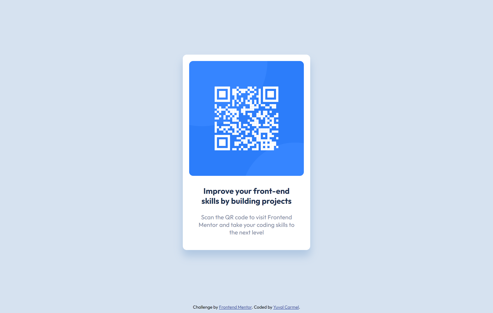

# Frontend Mentor - QR code component solution

This is a solution to the [QR code component challenge on Frontend Mentor](https://www.frontendmentor.io/challenges/qr-code-component-iux_sIO_H). Frontend Mentor challenges help you improve your coding skills by building realistic projects. 

## Table of contents

- [Overview](#overview)
  - [Screenshot](#screenshot)
  - [Links](#links)
- [My process](#my-process)
  - [Built with](#built-with)
  - [What I learned](#what-i-learned)
  - [Continued development](#continued-development)
  - [Useful resources](#useful-resources)
- [Author](#author)

**Note: Delete this note and update the table of contents based on what sections you keep.**

## Overview

### Screenshot




### Links

- Solution URL: [Solution URL](https://github.com/hoomi88/qr-code-component-main)
- Live Site URL: [Live URL](https://hoomi88.github.io/qr-code-component-main/

## My process

### Built with

- HTML
- CSS
- Flexbox

### What I learned

Use the margin: auto, to center the card in the window.

```css
  .card {
      height: 490px;
      width: 320px;
      background-color: hsl(0, 0%, 100%);
      display: flex;
      flex-direction: column;
      margin: auto;
      border-radius: 10px;
      box-shadow: 0 15px 20px 1px hsl(212, 45%, 79%);
    }
```

### Continued development

Now I need to start to involve JavaScript for the website design. Need to practice BEM.

### Useful resources

- [W3Schools](https://www.w3schools.com/) - good resource for CSS instructions and examples.

## Author

- Frontend Mentor - [@hoomi88](https://www.frontendmentor.io/profile/hoomi88)


